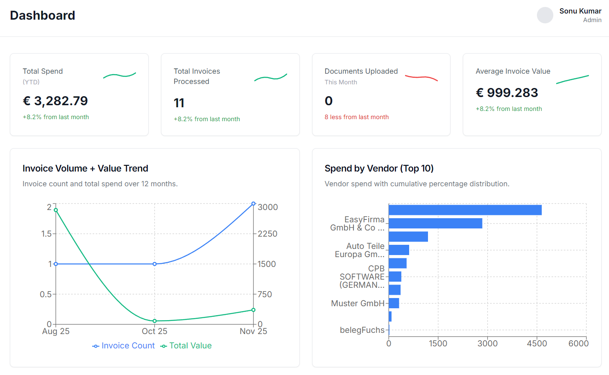
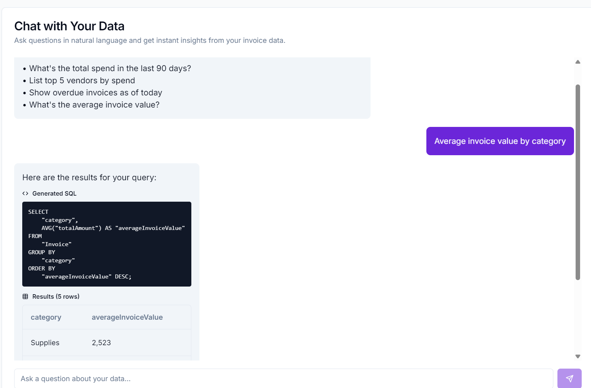

# 📊 AI-Powered Analytics Dashboard

A production-grade full-stack invoice analytics platform that transforms raw data into actionable insights using AI technology.

## 🚀 Live Demo

- **GitHub**: https://github.com/35sonu/Analytics-Dashboard

## ✨ Screenshots

### 📈 Dashboard Overview


Real-time analytics with interactive charts and key metrics at a glance.

### 💬 AI-Powered Chat Interface  


Ask questions in natural language and get instant SQL-powered insights.

### 📋 Invoice Management


Comprehensive invoice tracking with search, sort, and filter capabilities.

## ✨ Features

### 🎯 Real-time Analytics Dashboard
- Interactive overview cards with key metrics (Total Spend, Invoice Count, Documents, Average Value)
- Beautiful data visualizations with Recharts
- Multi-dimensional analysis with interactive charts
- Responsive design with purple-themed UI

### 🤖 AI-Powered Chat with Data
- Ask questions in natural language
- Automatic SQL generation using Groq AI (Llama 3.3 70B)
- Instant results with formatted tables
- View generated SQL queries for transparency
- Example queries for quick start

### 📊 Advanced Analytics
- Invoice volume and value trends over time
- Top 10 vendors by spend with cumulative distribution
- Spend analysis by category (pie chart)
- Cash outflow forecasting by due date ranges

### 📑 Invoice Management
- Searchable and sortable invoice table
- Real-time data from PostgreSQL
- Status tracking (Paid, Pending, Overdue)
- Category-based organization
- Pagination support

## 🛠️ Tech Stack

### Frontend
- **Framework**: Next.js 14 (App Router)
- **Language**: TypeScript
- **Styling**: Tailwind CSS
- **UI Components**: shadcn/ui (Radix UI primitives)
- **Charts**: Recharts
- **HTTP Client**: Axios

### Backend
- **API**: Express.js
- **ORM**: Prisma
- **Validation**: Zod
- **Runtime**: Node.js 18+
- **Database**: PostgreSQL (Supabase)

### AI/ML
- **LLM**: Groq AI (Llama 3.3 70B Versatile)
- **Framework**: FastAPI (Python)
- **NLP**: Natural language to SQL conversion
- **Database Connector**: SQLAlchemy + psycopg2

### Infrastructure
- **Monorepo**: Turborepo
- **Package Manager**: npm workspaces
- **Deployment**: Vercel (Frontend + Backend) + Render (AI Service)
- **Database Hosting**: Supabase

## 📦 Project Structure

```
├── apps/
│   ├── web/                    # Next.js frontend
│   │   ├── src/
│   │   │   ├── app/           # App router pages
│   │   │   ├── components/    # React components
│   │   │   ├── lib/           # API client & utilities
│   │   │   └── types/         # TypeScript types
│   │   └── package.json
│   └── api/                    # Express.js backend
│       ├── src/
│       │   ├── routes/        # API endpoints
│       │   └── scripts/       # Database seeding
│       ├── prisma/
│       │   └── schema.prisma  # Database schema
│       └── package.json
├── services/
│   └── vanna/                  # AI service (FastAPI)
│       ├── main.py
│       └── requirements.txt
├── screenshots/                # Project screenshots
├── turbo.json
└── package.json
```

## 🚀 Getting Started

### Prerequisites

- Node.js 18+
- Python 3.11+
- PostgreSQL 15+ (or Supabase account)
- Groq API Key (free at https://console.groq.com)

### Installation

1. **Clone the repository**
```bash
git clone https://github.com/35sonu/Analytics-Dashboard.git
cd Analytics-Dashboard
```

2. **Install dependencies**
```bash
npm install
```

3. **Setup Backend API**
```bash
cd apps/api
cp .env.example .env
# Edit .env with your DATABASE_URL
npx prisma generate
npx prisma db push
npm run db:seed
```

4. **Setup Frontend**
```bash
cd apps/web
cp .env.example .env.local
# Add: NEXT_PUBLIC_API_URL=http://localhost:3001
# Add: NEXT_PUBLIC_VANNA_URL=http://localhost:8000
```

5. **Setup Vanna AI Service**
```bash
cd services/vanna
cp .env.example .env
# Add your DATABASE_URL and GROQ_API_KEY
pip install -r requirements.txt
```

### Running Locally

Run all services:

```bash
# Terminal 1 - Backend API
cd apps/api
npm run dev

# Terminal 2 - Frontend
cd apps/web
npm run dev

# Terminal 3 - Vanna AI
cd services/vanna
python main.py
```

Access the application:
- **Frontend**: http://localhost:3000
- **Backend API**: http://localhost:3001
- **Vanna AI**: http://localhost:8000

## 🌐 Deployment

### Frontend & Backend (Vercel)

1. Push code to GitHub
2. Import repository to Vercel (create 2 projects)

**Frontend Project:**
- Root Directory: `apps/web`
- Framework: Next.js
- Environment Variables:
  - `NEXT_PUBLIC_API_URL`: Your backend URL
  - `NEXT_PUBLIC_VANNA_URL`: Your Vanna service URL

**Backend Project:**
- Root Directory: `apps/api`
- Build Command: `npm run vercel-build`
- Environment Variables:
  - `DATABASE_URL`: Your PostgreSQL connection string

### AI Service (Render)

1. Create new Web Service on Render
2. Connect GitHub repository
3. Configure:
   - Root Directory: `services/vanna`
   - Build Command: `pip install -r requirements.txt`
   - Start Command: `uvicorn main:app --host 0.0.0.0 --port $PORT`
4. Environment Variables:
   - `DATABASE_URL`: PostgreSQL connection
   - `GROQ_API_KEY`: Your Groq API key
   - `MODEL_NAME`: `llama-3.3-70b-versatile`

## 📡 API Endpoints

### Analytics API (Express.js)

- `GET /api/stats` - Overview statistics
- `GET /api/invoice-trends` - Invoice trends over time
- `GET /api/vendors/top10` - Top 10 vendors by spend
- `GET /api/invoice-trends/category` - Spend by category
- `GET /api/invoice-trends/cash-outflow` - Cash outflow forecast
- `GET /api/invoices` - List invoices with pagination and search

### AI Service (FastAPI)

- `POST /api/query` - Natural language to SQL conversion
  ```json
  {
    "question": "What's the total spend in the last 90 days?"
  }
  ```
- `GET /health` - Health check endpoint

## 🎯 Key Features Explained

### Natural Language Processing
The chat interface uses Groq's Llama 3.3 70B model to:
1. Understand natural language questions
2. Generate PostgreSQL queries based on database schema
3. Execute queries safely with proper error handling
4. Format and return results in a user-friendly table

### Database Schema
Normalized relational design:
- **Vendor** → **Invoice** (1:N)
- **Customer** → **Invoice** (1:N)
- **Invoice** → **LineItem** (1:N)
- **Invoice** → **Payment** (1:N)

### Performance Optimizations
- Server-side data fetching with Next.js
- Database connection pooling with Prisma
- Optimized SQL queries with proper indexing
- Efficient chart rendering with Recharts

## 🤝 Contributing

Contributions are welcome! Please feel free to submit a Pull Request.

1. Fork the repository
2. Create your feature branch (`git checkout -b feature/AmazingFeature`)
3. Commit your changes (`git commit -m 'Add some AmazingFeature'`)
4. Push to the branch (`git push origin feature/AmazingFeature`)
5. Open a Pull Request

## 📝 License

MIT License - feel free to use this project for learning or commercial purposes.

## 👨‍💻 Author

**Sonu Kumar**
- GitHub: [@35sonu](https://github.com/35sonu)
- Project: [Analytics Dashboard](https://github.com/35sonu/Analytics-Dashboard)

## 🙏 Acknowledgments

- [Groq AI](https://groq.com) for the powerful LLM API
- [Supabase](https://supabase.com) for PostgreSQL hosting
- [Vercel](https://vercel.com) for seamless deployment
- [shadcn/ui](https://ui.shadcn.com) for beautiful components
- [Recharts](https://recharts.org) for amazing data visualizations

---

⭐ If you found this project helpful, please give it a star on GitHub!

🔗 **Live Demo**: [Coming Soon]
📧 **Questions?**: Open an issue on GitHub
